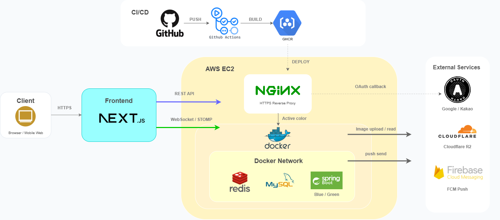
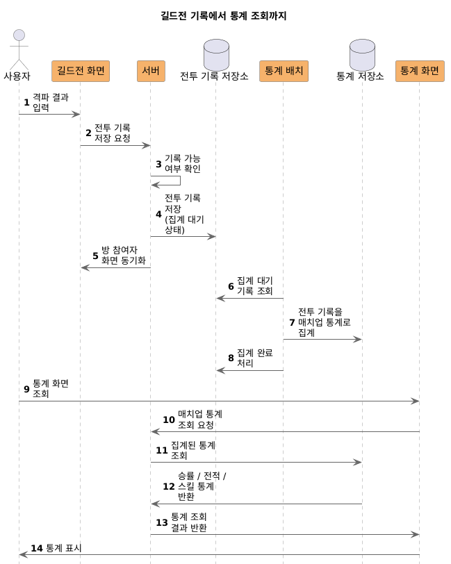
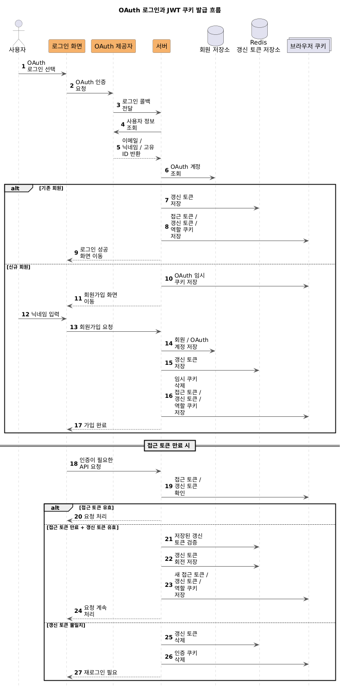
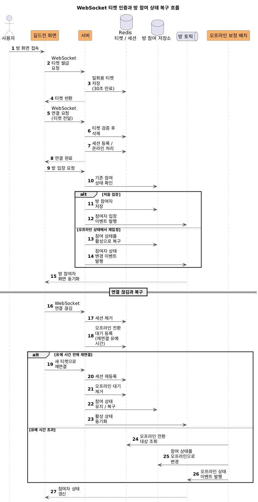
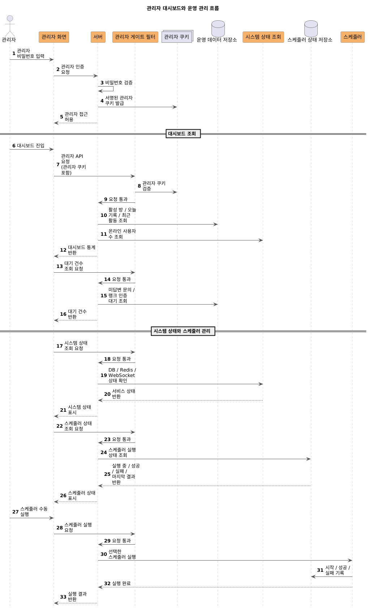
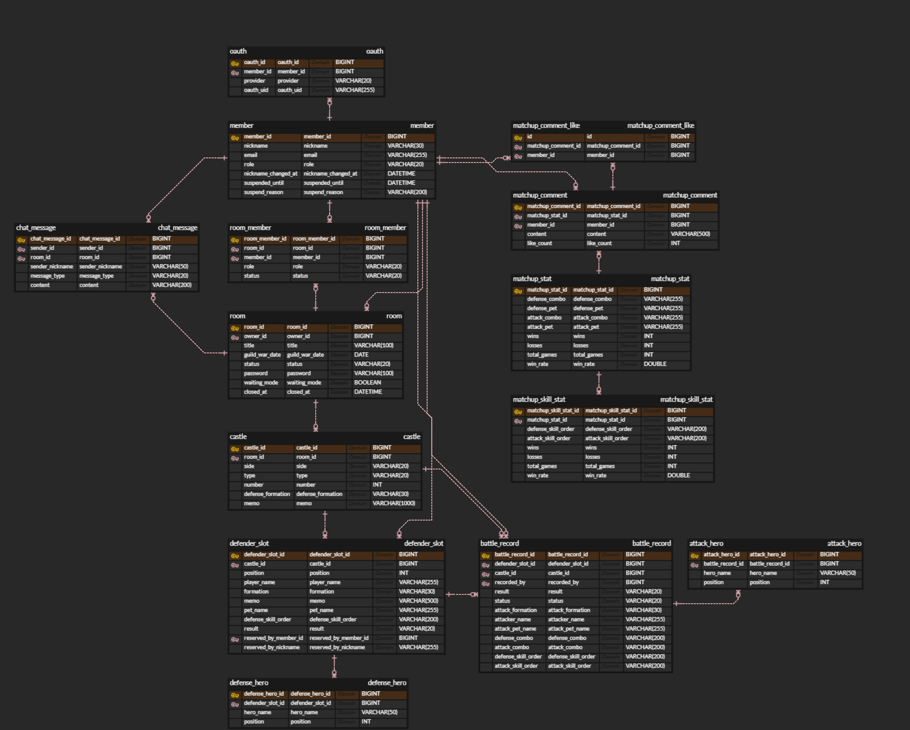
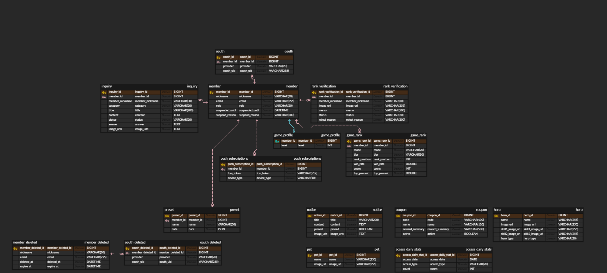
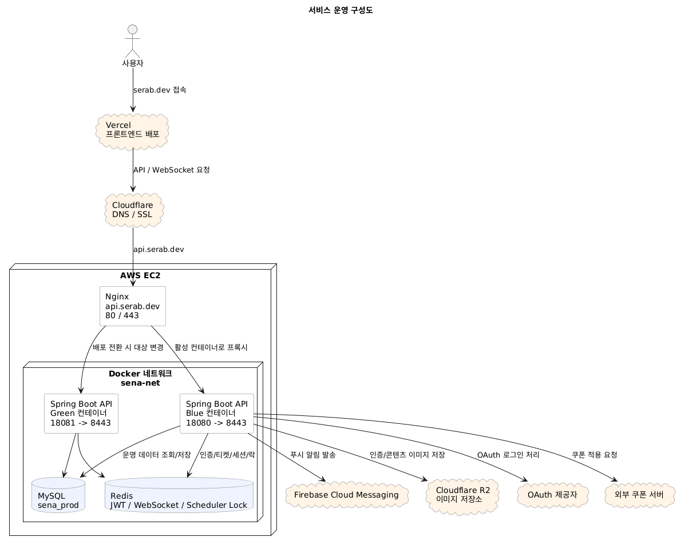
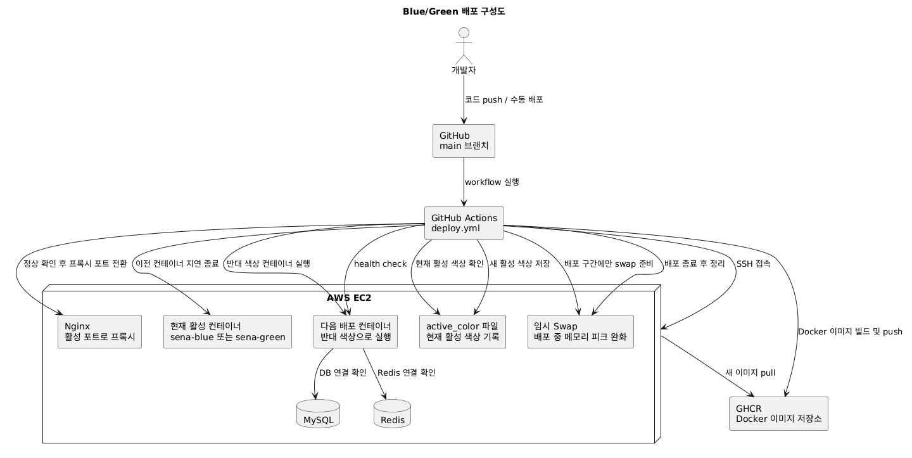

# SeRab 프로젝트

세븐나이츠 길드전 컨텐츠를 보조하는 실시간 협업, 전투 기록 관리, 통계 집계 웹 서비스

| 구분 | 내용 |
|-----|------|
| 개발 인원 | 1인 (백엔드 설계/구현/배포/문서화) |
| 서비스 상태 | EC2 + Docker 환경에서 운영 · [serab.dev](https://serab.dev) |
| 프론트엔드 | Next.js 기반, AI 도구를 활용해 구성 |

---

## 프로젝트 개요

SeRab은 세븐나이츠 길드전 진행 중 참여자들이 같은 방에서 역할, 성 메모, 방어 슬롯, 채팅, 격파 기록을 함께 관리할 수 있도록 만든 협업 서비스입니다.

단순한 기록 저장에 그치지 않고, 누적된 전투 데이터를 바탕으로 방어 조합 통계, 공격 매치업 상세, 기여자 랭킹, 개인 전적 같은 조회 기능까지 연계하여 제공하도록 설계했습니다.

또한 관리자 대시보드, 접속 통계, 랭크 인증, 공지/문의/쿠폰 관리 기능을 함께 구성해 실제 운영 가능한 서비스 형태를 목표로 개발했습니다.

## 빠르게 보기 목차

| 보고 싶은 내용   | 링크 |
|------------|---|
| 사용자 화면 흐름  | [시연 자료 모음](docs/demo.md) |
| 관리자 운영 화면  | [관리자/운영 시연 자료](docs/admin-demo.md) |
| 핵심 비즈니스 흐름 | [길드전 기록에서 통계 집계까지](docs/scenarios/guild-war-to-stats.md) |
| 데이터 모델     | [데이터 모델 설계](docs/data-model.md) |
| 테스트 기준     | [테스트 전략 문서](docs/testing.md) |
| 개발 중 겪은 문제 | [트러블슈팅 문서 목차](docs/troubleshooting/troubleshooting-index.md) |
| API 문서     | [API 문서 목차](#api-문서) |

## 핵심 기능

### 1. 실시간 길드전 협업
- WebSocket(STOMP) 기반 방 동기화와 채팅 지원
- 방 참여자 역할 변경, 방장 위임, 강퇴, 대기방 모드 토글 제공
- 성 메모, 방어 슬롯, 예약 상태를 같은 방 참여자끼리 실시간으로 공유

### 2. 전투 기록 관리
- 격파 기록 생성, 결과 수정, 최근 전투 이력 조회 지원
- 길드전 운영 흐름에 맞춰 방어 진형, 영웅 구성, 스킬 순서, 공격 결과를 구조화해 저장
- 실시간 협업 화면과 기록 데이터가 이어지도록 설계

### 3. 통계 집계 및 조회
- 방어 조합 목록, 공격 통계, 매치업 상세, 방어 랭킹, 기여자 랭킹, 개인 통계 제공
- 누적 전투 데이터를 조회용 API로 분리해 운영 중에도 빠르게 확인 가능
- 댓글, 좋아요 등 사용자 참여 기능 포함

### 4. 운영 보조 기능
- 관리자 대시보드, 접속 통계, 회원/방/컨텐츠 관리 기능 제공
- 공지사항, 문의, 쿠폰, 푸시 구독 관리 지원
- Swagger/OpenAPI 기반 API 문서화로 유지보수성과 협업 편의성 강화

## 기술 스택

| 구분 | 내용 |
|-----|------|
| Backend | Java, Spring Boot, Spring MVC, Spring Security, Validation |
| Data | Spring Data JPA, QueryDSL, MySQL, Redis, Flyway |
| Real-time | WebSocket, STOMP, SockJS |
| Auth | OAuth2, JWT, HttpOnly Cookie, Redis Refresh Token |
| Infra | Docker, Cloudflare R2, Firebase Cloud Messaging |
| Docs / Test | Swagger(OpenAPI), JUnit 5, Spring Boot Test |

## 테스트

테스트는 서비스 계층의 정책 검증을 중심으로 작성했고, WebSocket 접속 상태 복구, JWT/OAuth 인증 흐름, 통계 집계 기준, 스케줄러 예외 처리처럼 운영 중 문제가 발생하기 쉬운 부분을 따로 확인했습니다. JaCoCo 커버리지 리포트도 포함되어 있습니다.

자세한 기준은 [테스트 전략 문서](docs/testing.md)에 정리했습니다.

## 아키텍처

## 주요 시퀀스 다이어그램

프로젝트의 핵심 흐름을 시퀀스 다이어그램으로 정리했습니다.\
각 이미지를 클릭하면 원본 크기로 확인할 수 있습니다.

<table>
  <tr>
    <td align="center" width="50%">
      
       
      길드전 기록 → 통계 조회
    </td>
    <td align="center" width="50%">
      
       
      OAuth 로그인 → JWT 쿠키 발급
    </td>
  </tr>
  <tr>
    <td align="center" width="50%">
      
       
      WebSocket 티켓 인증 → 방 참여 상태 복구
    </td>
    <td align="center" width="50%">
      
       
      관리자 대시보드 → 운영 관리
    </td>
  </tr>
</table>

## 주요 ERD

핵심 비즈니스 도메인과 운영/관리 도메인을 분리해 ERD로 정리했습니다.\
각 이미지를 클릭하면 원본 크기로 확인할 수 있습니다.

<table>
  <tr>
    <td align="center" width="50%">
      
       
      핵심 비즈니스 ERD
    </td>
    <td align="center" width="50%">
      
       
      운영/관리 ERD
    </td>
  </tr>
</table>

## 배포 구성

서비스 운영 환경과 Blue/Green 배포 흐름을 구성도로 정리했습니다.\
각 이미지를 클릭하면 원본 크기로 확인할 수 있습니다.

<table>
  <tr>
    <td align="center" width="50%">
      
       
      서비스 운영 구성도
    </td>
    <td align="center" width="50%">
      
       
      Blue/Green 배포 구성도
    </td>
  </tr>
</table>

## 시연 자료

실제 화면 흐름은 GIF와 스크린샷으로 따로 정리했습니다.\
자세한 내용은 아래 [추천 읽기 순서](#추천-읽기-순서)를 참고하면 됩니다.

- [시연 자료 모음](docs/demo.md) · [관리자/운영 시연 자료](docs/admin-demo.md) · [길드전 기록에서 통계 집계까지](docs/scenarios/guild-war-to-stats.md)

## 설계 포인트

- 길드전 기록은 먼저 원본 전투 기록으로 저장하고, 승률 계산과 통계 갱신은 배치에서 처리하도록 분리
- WebSocket 연결 상태와 방 참여 상태를 나눠, 실제로 방에 들어와 있는 사용자에게만 방 내부 변경 사항을 동기화
- disconnect 직후 바로 퇴장 처리하지 않고 `OFFLINE` 상태와 재연결 유예 시간을 두어 일시적인 네트워크 끊김을 보정
- OAuth2/JWT 기반 API 인증과 일회용 WebSocket 티켓 인증을 분리해, WebSocket 연결 시에도 서버가 인증 주체를 직접 검증
- Redis를 Refresh Token, WebSocket 세션, 오프라인 보정, 스케줄러 락, 푸시 알림 상태 관리에 활용

## 개발 및 운영 경험

- 관리자 대시보드에서 DB, Redis, WebSocket, 스케줄러 상태를 함께 확인할 수 있도록 구성
- 소형 EC2 환경에서 Blue/Green 배포 중 메모리 압박이 발생하는 문제를 점검하고 배포 스크립트와 전환 절차를 보정
- Swagger/OpenAPI 문서 노출 범위와 내부 모델 노출 여부를 테스트로 검증
- WebSocket 상태 싱크, 통계 집계 기준, Blue/Green 배포 이슈를 트러블슈팅 문서로 따로 정리

## 문서 바로가기

### 추천 읽기 순서
- [시연 자료 모음](docs/demo.md): 실제 화면 흐름과 주요 GIF 확인
- [관리자/운영 시연 자료](docs/admin-demo.md): 관리자 대시보드와 운영 도구 흐름 확인
- [길드전 기록에서 통계 집계까지](docs/scenarios/guild-war-to-stats.md): 기록 데이터가 통계 화면에 반영되는 흐름
- [테스트 전략 문서](docs/testing.md): 어떤 기준으로 테스트를 남겼는지 정리
- [WebSocket 접속 상태와 방 참여 상태 싱크 문제](docs/troubleshooting/websocket-room-presence-sync.md): 이 프로젝트에서 가장 많이 고민한 실시간 상태 문제
- [전투 기록 기반 통계 집계와 스킬 순서 중복 노출 문제](docs/troubleshooting/stats-aggregation-consistency.md): 저장하기 좋은 데이터와 보여주기 좋은 데이터의 차이
- [블루/그린 배포 시 EC2 메모리 압박 문제](docs/troubleshooting/blue-green-ec2-memory-pressure.md): 작은 서버에서 배포 안정성을 맞춰간 과정

### 기술 문서 목차
- [시스템 관리 문서 목차](docs/system/system-overview.md)
- [WebSocket 문서 목차](docs/websocket/websocket-index.md)
- [Security 문서 목차](docs/security/security-index.md)
- [스케줄러 문서 목차](docs/scheduler/scheduler-overview.md)
- [트러블슈팅 문서 목차](docs/troubleshooting/troubleshooting-index.md)

### 트러블슈팅
- [트러블슈팅 문서 목차](docs/troubleshooting/troubleshooting-index.md)

### API 문서
- [Member API 목차](docs/api/member-index.md)
- [Room API 목차](docs/api/room-index.md)
- [Stats API 목차](docs/api/stats-index.md)
- [Push API 목차](docs/api/push-index.md)
- [Admin API 목차](docs/api/admin-index.md)
- [Hero API 목차](docs/api/hero-index.md)
- [Notice API 목차](docs/api/notice-index.md)
- [Inquiry API 목차](docs/api/inquiry-index.md)
- [Coupon API 목차](docs/api/coupon-index.md)
- [Preset API 목차](docs/api/preset-index.md)

### 세부 설계 메모
- [데이터 모델 설계](docs/data-model.md)
- [WebSocket Disconnect 처리](docs/websocket/websocket-disconnect-handling.md)
- [Push 알림 동작 메모](docs/system/push-notification-flow.md)
- [티켓 기반 WebSocket 인증](docs/websocket/websocket-ticket-auth.md)
