# 관리자/운영 시연 자료

관리자 화면에서 서비스 상태를 확인하고, 회원/방/콘텐츠/통계 데이터를 운영하는 흐름을 정리한 문서입니다.\
일반 사용자 기능과 분리해, 실제 운영 도구로 구성한 부분을 한눈에 볼 수 있도록 묶었습니다.

## 관리자 접근과 대시보드

| 관리자 인증 | 관리자 대시보드 |
|---|---|
| <a href="assets/demo/admin/admin-auth.gif">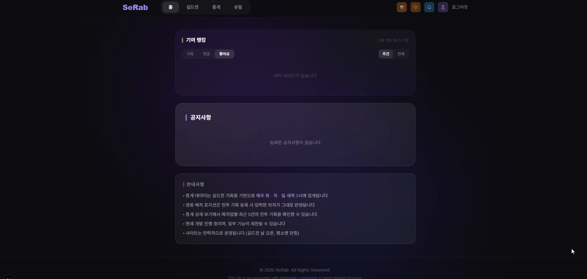</a> | <a href="assets/demo/admin/admin-dashboard.jpg">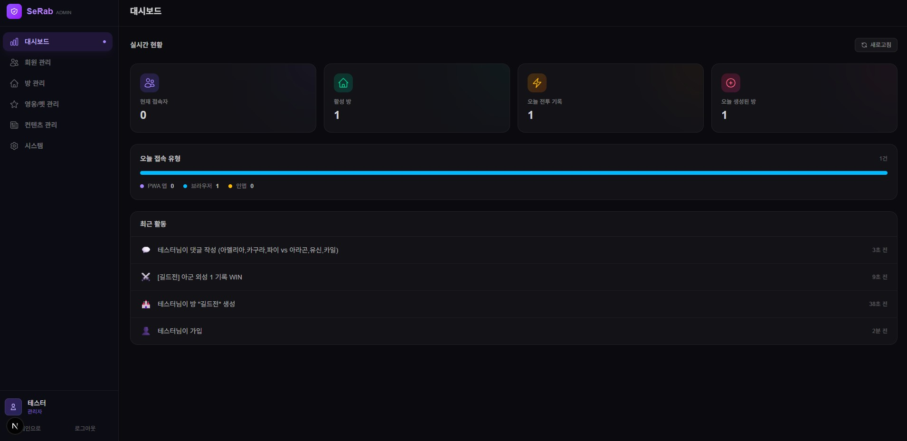</a> |
| 관리자 비밀번호를 검증한 뒤 관리자 화면에 접근합니다. | 현재 접속자, 활성 방, 오늘 전투 기록, 최근 활동을 확인합니다. |

## 시스템 운영

| 서비스 상태와 스케줄러 | 통계 데이터 관리 |
|---|---|
| <a href="assets/demo/admin/scheduler-status.gif">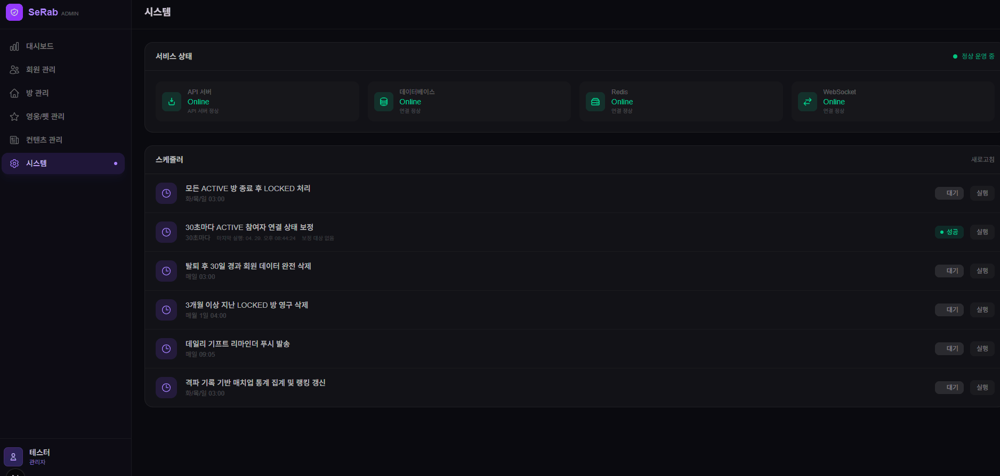</a> | <a href="assets/demo/admin/stats-manage.jpg">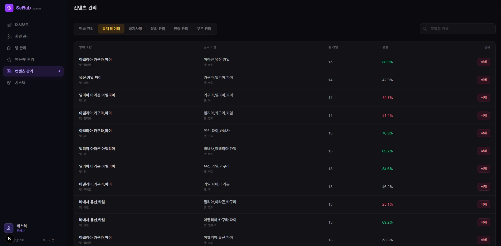</a> |
| API, DB, Redis, WebSocket 상태와 주요 스케줄러 실행 상태를 확인합니다. | 집계된 매치업 통계를 검색하고 필요 시 삭제할 수 있습니다. |

## 회원 운영

| 회원 관리 | 탈퇴 대기 관리 |
|---|---|
| <a href="assets/demo/admin/user-manage.gif">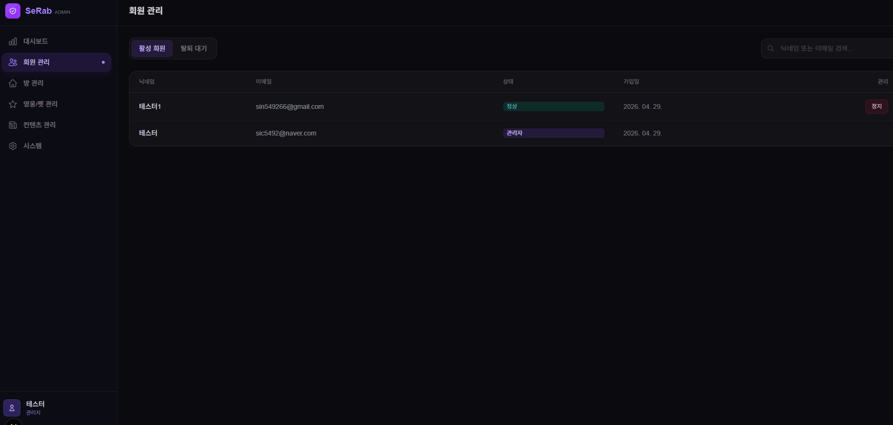</a> | <a href="assets/demo/admin/withdraw-queue.jpg">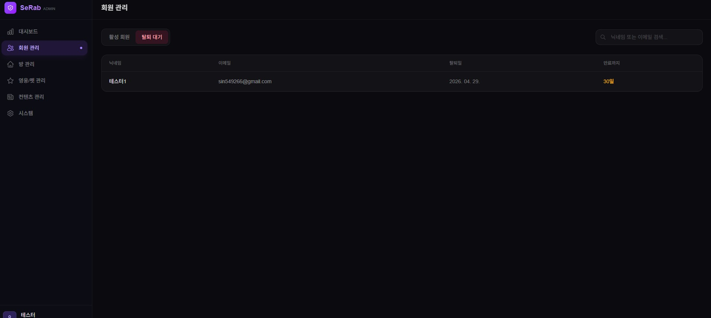</a> |
| 활성 회원과 관리자 계정을 조회하고 활동 정지를 처리합니다. | 탈퇴 요청 후 보관 기간이 남은 계정을 확인합니다. |

| 활동 정지 상태 | 댓글 작성 제한 |
|---|---|
| <a href="assets/demo/admin/suspend-profile.jpg">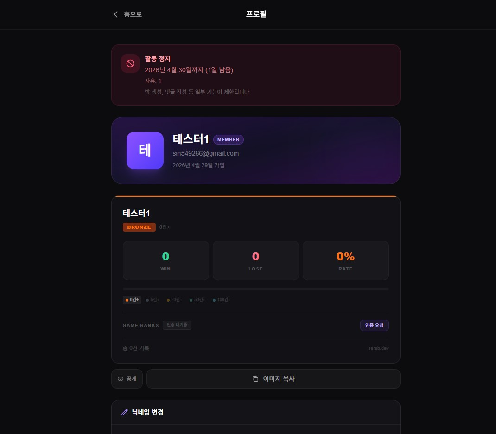</a> | <a href="assets/demo/admin/suspend-comment.jpg">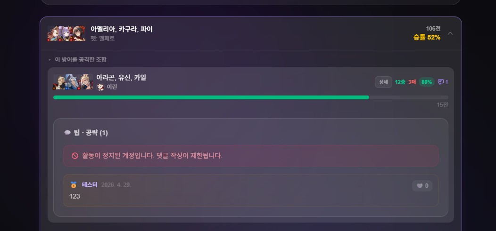</a> |
| 활동 정지 기간과 사유를 사용자 프로필에서 확인할 수 있습니다. | 정지된 계정은 댓글 작성 같은 일부 기능이 제한됩니다. |

## 방 운영

| 옵저버 모드 | 종료된 방 관리 |
|---|---|
| <a href="assets/demo/admin/observer-room.gif">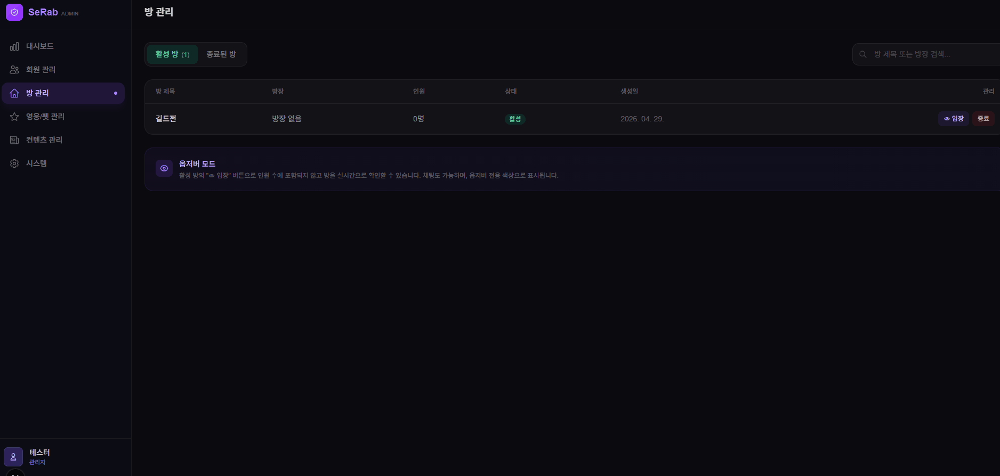</a> | <a href="assets/demo/admin/closed-room.jpg">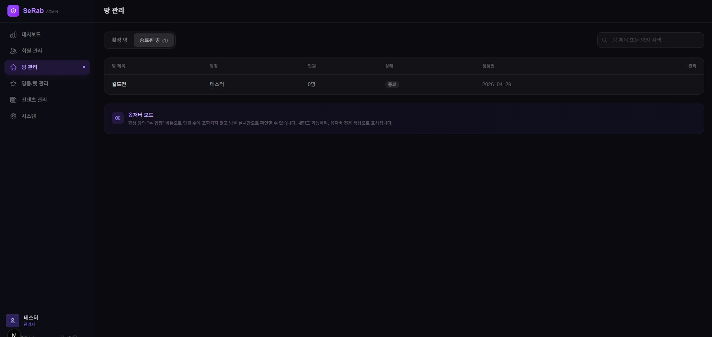</a> |
| 관리자가 활성 방에 옵저버로 진입해 방 상태를 확인합니다. | 종료된 방과 잠긴 방을 분리해 운영 상태를 확인합니다. |

## 콘텐츠 운영

| 댓글 관리 | 공지사항 관리 |
|---|---|
| <a href="assets/demo/admin/comment-manage.jpg">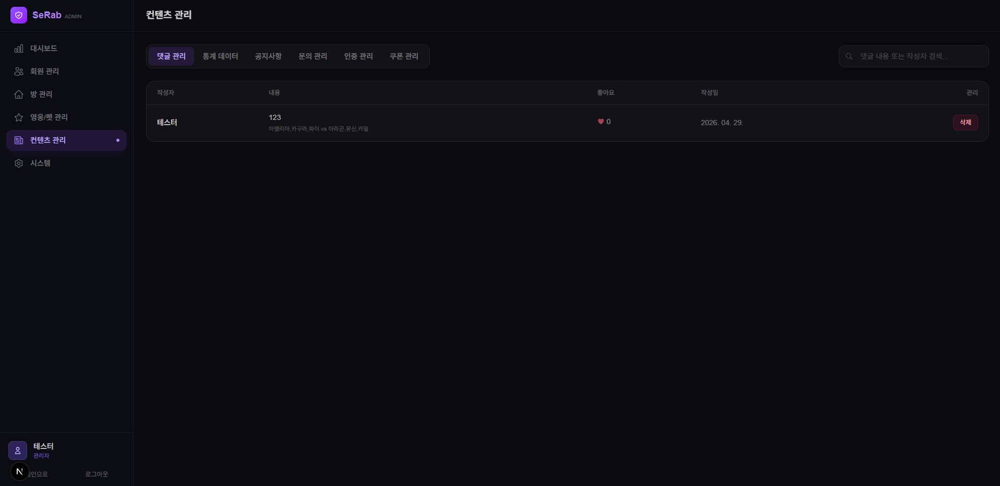</a> | <a href="assets/demo/admin/notice-manage.gif">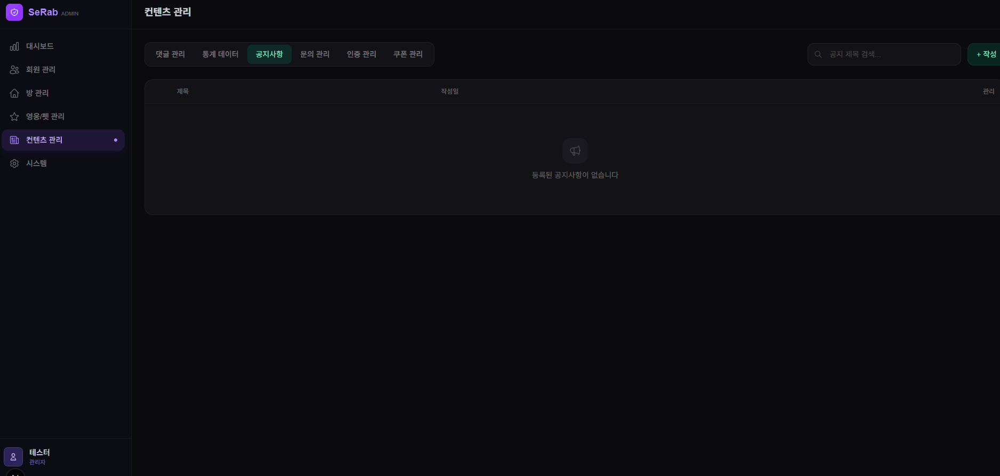</a> |
| 통계 댓글을 조회하고 삭제할 수 있습니다. | 서비스 공지사항을 작성하고 관리합니다. |

| 문의 관리 | 랭크 인증 관리 |
|---|---|
| <a href="assets/demo/admin/inquiry-manage.gif">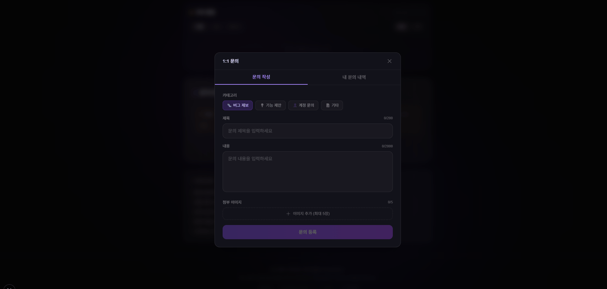</a> | <a href="assets/demo/admin/tier-auth.gif">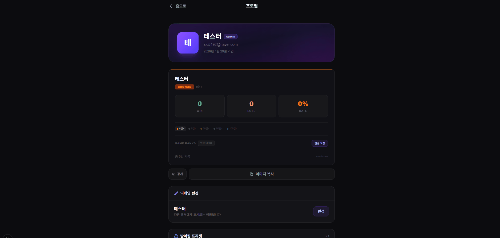</a> |
| 사용자가 남긴 문의를 확인하고 답변합니다. | 사용자가 제출한 랭크 인증 이미지를 승인하거나 반려합니다. |

| 영웅/펫 관리 |
|---|
|  |
| 영웅과 펫 데이터를 등록하고 관리합니다. |

## 관련 문서

- [시연 자료 모음](demo.md)
- [관리자 API 문서](api/admin-index.md)
- [시스템 관리 문서 목차](system/system-overview.md)
- [스케줄러 문서 목차](scheduler/scheduler-overview.md)
- [관리자 게이트 필터](security/admin/admin-gate-filter.md)
