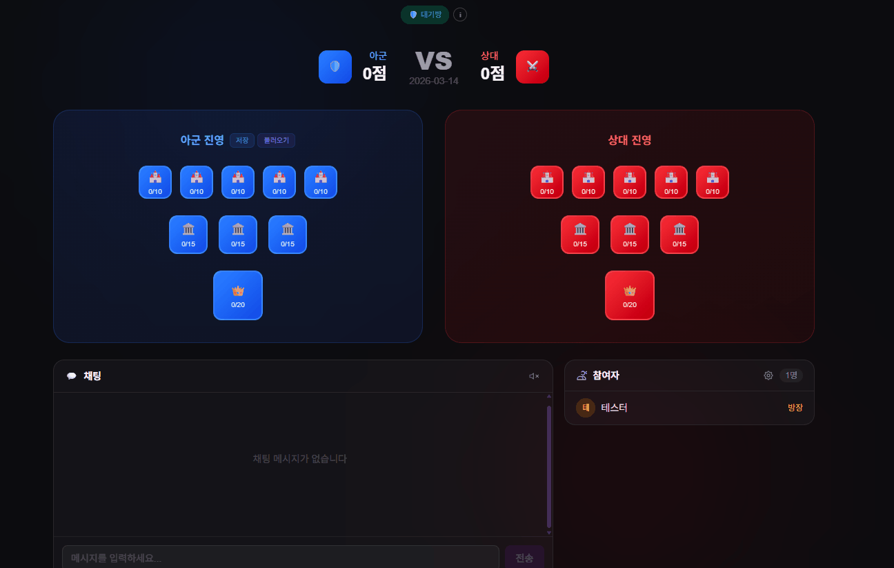
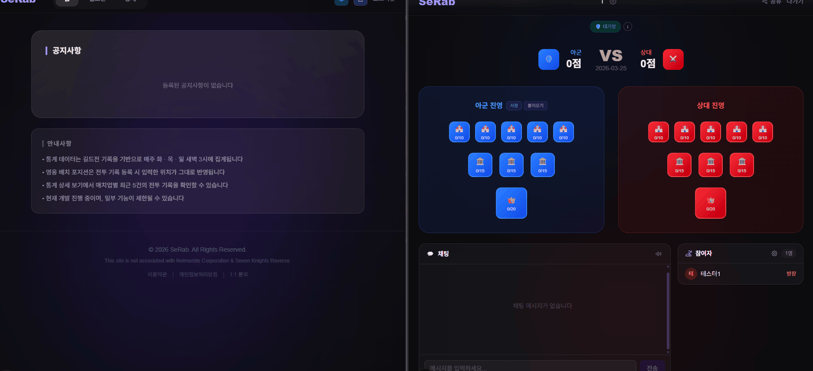
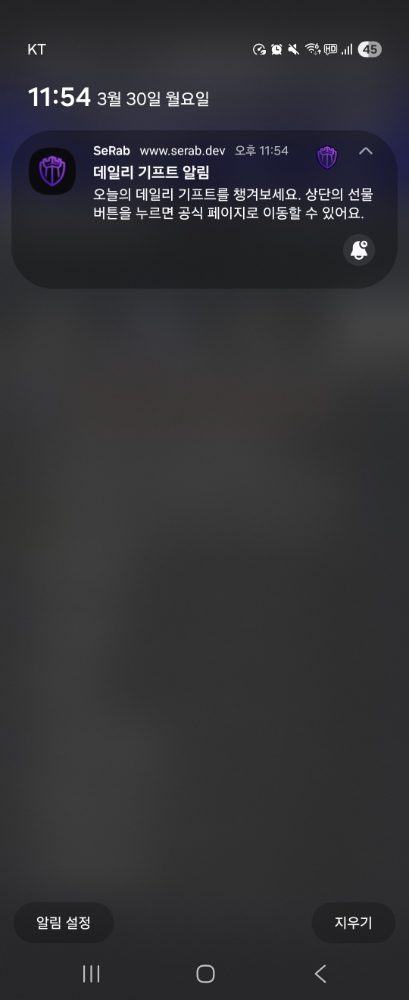
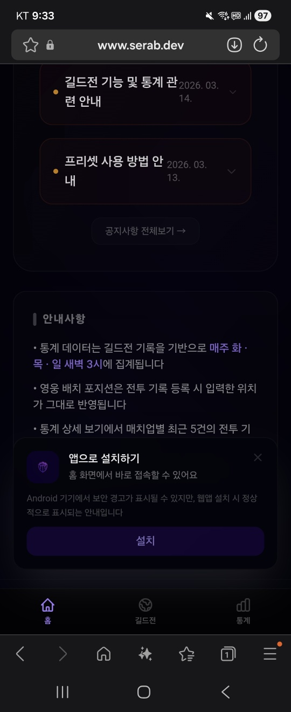

# 시연 자료

주요 기능을 GIF와 스크린샷으로 묶은 문서입니다.\
README에서는 구조와 설계 의도를 먼저 보여주고, 실제 화면 흐름은 이 문서에서 확인할 수 있도록 분리했습니다.

관리자 화면과 운영 도구는 [관리자/운영 시연 자료](admin-demo.md)에 따로 정리했습니다.

## 핵심 시나리오

| 길드전 기록에서 통계 집계까지                                                                                                                           | 실시간 방 동기화                                                                                                                   |
|--------------------------------------------------------------------------------------------------------------------------------------------|-----------------------------------------------------------------------------------------------------------------------------|
|  |  |
| 방어팀, 예약자, 격파 기록이 통계 화면에 반영되는 흐름입니다. (스케줄러 실행 시)                                                                                            | 같은 방 참여자가 전투 상황을 실시간으로 동기화를 하는 흐름입니다.                                                                                       |

자세한 설명은 [길드전 기록에서 통계 집계까지](scenarios/guild-war-to-stats.md)에 따로 정리했습니다.

## 길드전 운영

| 방어팀 구성 | 예약자 및 격파 기록 |
|---|---|
|  |  |
| 방어 슬롯에 영웅, 펫, 배치 정보를 입력합니다. | 예약자와 격파 결과를 함께 관리합니다. |

| 프리셋 저장/불러오기 | 편의 기능                                                                                                               |
|---|---------------------------------------------------------------------------------------------------------------------|
|  |  |
| 반복되는 진형 입력을 프리셋으로 저장하고 다시 불러옵니다. | 방을 운영할 때 필요한 보조 기능을 모았습니다.                                                                                          |

## 통계 조회

| 매치업 통계 | 방어 통계 |
|---|---|
|  |  |
| 공격 조합과 방어 조합의 매치업 결과를 조회합니다. | 방어 조합 기준으로 성공률과 기록을 확인합니다. |

## 모바일, 푸시, 설치 흐름

| FCM 푸시 알림                                                                                                         | 데일리 알림 |
|-------------------------------------------------------------------------------------------------------------------|---|
|  |  |
| 브라우저 푸시 권한과 FCM 토큰을 기반으로 알림을 발송합니다. (온/오프라인 상태 동기화)                                                               | 모바일 기기에서 받은 실제 알림 화면입니다. |

| PWA 설치 | 앱 설치 안내 |
|---|---|
|  |  |
| 웹앱을 홈 화면에 설치하는 흐름입니다. | 모바일 브라우저에서 표시되는 설치 안내입니다. |

| 딥링크 |
|---|
|  |
| 외부 링크에서 방 화면으로 바로 진입하는 흐름입니다. |
