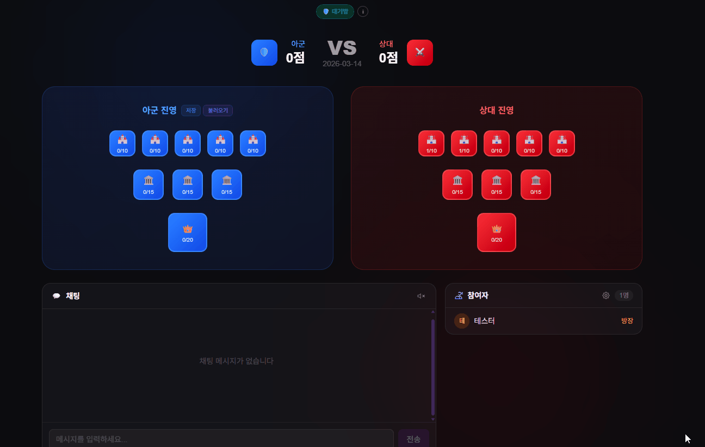
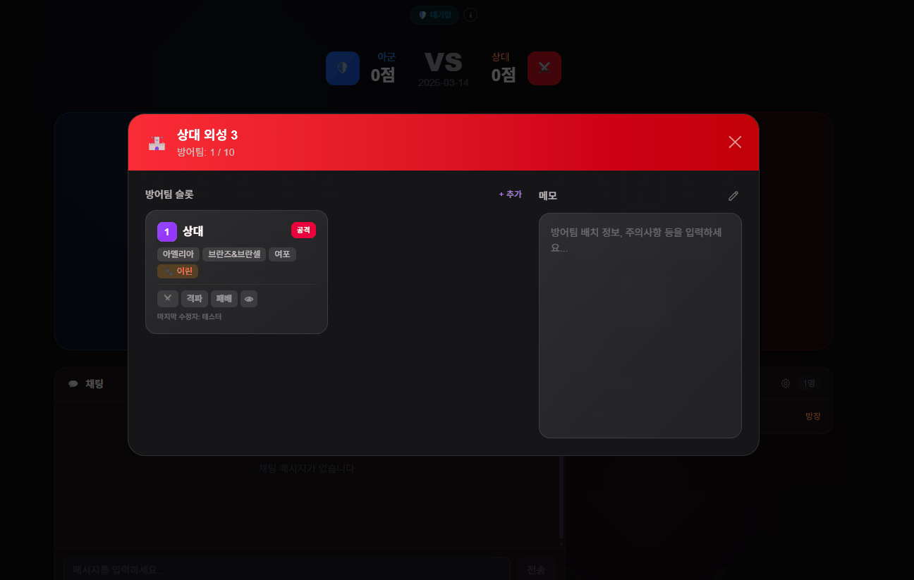
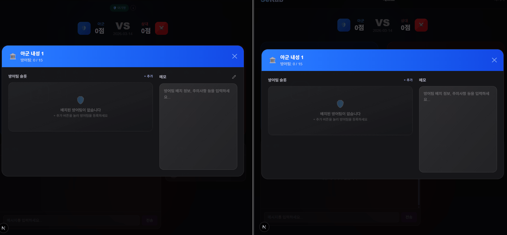
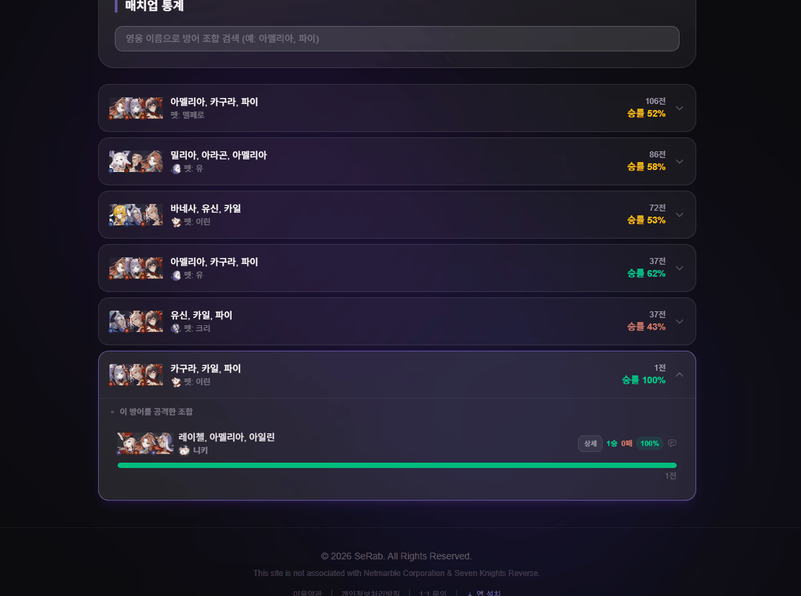
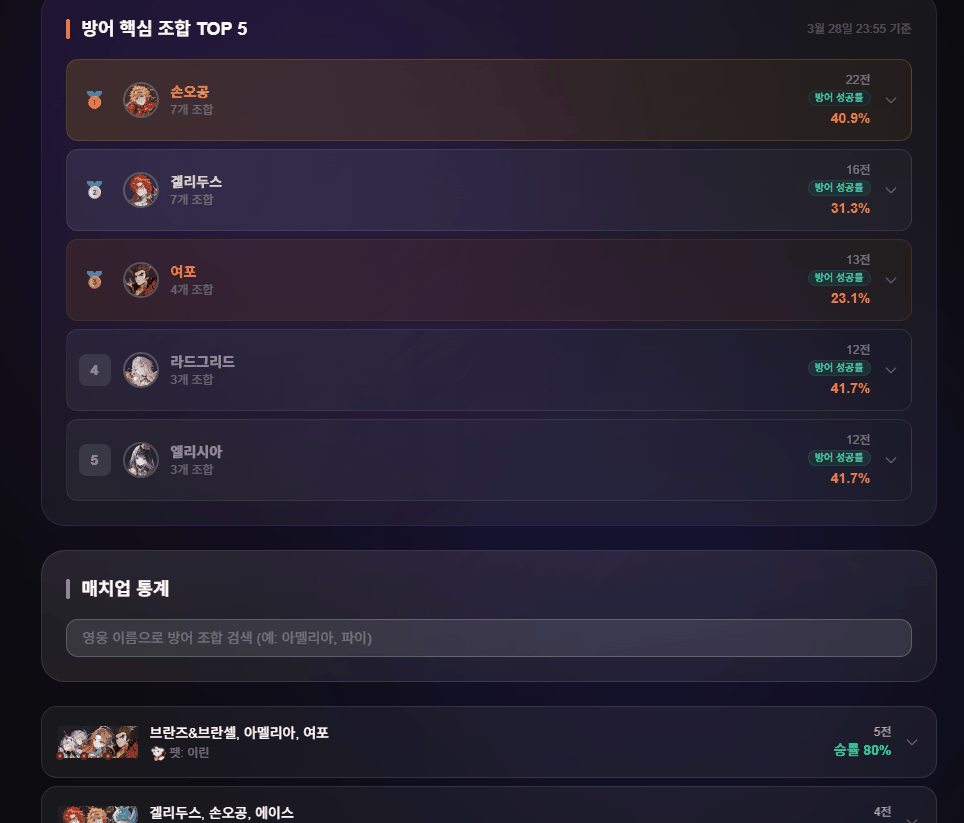

# 길드전 기록에서 통계 집계까지

길드전 방에서 입력한 전투 기록이 통계 화면에서 조회 가능한 데이터로 바뀌는 흐름을 정리한 문서입니다.

이 흐름은 단순히 화면에 결과를 저장하는 기능이 아니라, 여러 사용자가 같은 방에서 기록을 남기고 그 기록이 나중에 통계 집계 기준으로 다시 사용되는 과정입니다.

## 전체 흐름

1. 방장이 길드전 방을 만들고 방어 진영을 준비합니다. (일반 사용자도 배치 가능, 프리셋(방장))
2. 방 참여자가 방어 슬롯에 영웅, 펫, 스킬 순서, 메모를 입력합니다.
3. 공격 결과가 생기면 예약자와 격파 결과를 함께 기록합니다.
4. 서버는 기록 가능한 상태인지 확인한 뒤 전투 기록을 저장합니다.
5. 방 안의 다른 참여자에게 WebSocket 이벤트로 변경 내용을 동기화합니다.
6. 통계 배치가 집계 대기 상태의 전투 기록을 조회합니다.
7. 배치는 전투 기록에서 방어 조합, 공격 조합, 펫, 스킬 순서, 승패 결과를 꺼내 통계 집계 기준으로 변환합니다.
8. 같은 조합의 통계가 이미 있으면 승패 수치를 누적하고, 없으면 새 통계 데이터를 만듭니다.
9. 매치업 통계와 스킬 순서 통계에 집계 결과를 반영합니다.
10. 반영이 끝난 전투 기록은 다음 배치 대상에서 제외되도록 상태를 바꿉니다.
11. 사용자는 통계 화면에서 갱신된 승률, 전적, 최근 전투 기록을 조회합니다.

## 1. 방어팀 구성

방어 슬롯에는 방어팀 이름, 영웅, 펫, 배치, 스킬 순서, 메모가 함께 저장됩니다.\
전투 기록이 남을 때 이 정보가 기준값으로 사용되기 때문에, 단순 입력 화면이 아니라 이후 통계 집계의 출발점이 됩니다.

## 2. 예약자와 격파 기록

한 슬롯에 대해 예약자와 격파 결과를 따로 관리합니다.\
기록을 저장할 때는 누가 기록했는지, 어떤 방어 슬롯에 대한 결과인지, 공격 조합과 결과가 무엇인지 함께 남깁니다.

## 3. 실시간 동기화

전투 기록이 저장되면 같은 방 참여자에게 바로 반영됩니다.\
방 참여 상태와 WebSocket 연결 상태를 분리해 두었기 때문에, 실제로 방에 들어와 있는 사용자에게만 방 내부 변경 사항을 동기화합니다.

## 4. 통계 집계 반영

통계 데이터는 전투 기록을 바로 덮어쓰는 방식이 아니라, 원본 전투 기록을 읽어 조회용 통계 데이터로 다시 정리하는 방식입니다.\
현재 안내 기준으로는 매주 화, 목, 일 새벽 3시에 집계되며, 방어 조합과 공격 조합의 승패 수치, 스킬 순서별 승률을 갱신합니다. 집계가 끝난 뒤에는 매치업 통계와 방어 통계 화면에서 결과를 확인할 수 있습니다.

## 5. 통계 조회

집계된 데이터는 조회 화면에서 방어 조합, 공격 조합, 승률, 최근 전투 기록 기준으로 확인합니다.\
전투 기록 입력 화면과 통계 조회 화면을 분리해, 운영 중에는 기록을 빠르게 남기고 이후에는 누적 데이터를 기준으로 판단할 수 있게 했습니다.

| 매치업 통계 | 방어 통계 |
|---|---|
|  |  |

## 설계 의도

- 전투 기록 저장 시점에는 원본 기록만 남기고, 승률 계산과 통계 갱신은 배치에서 처리하도록 분리했습니다.
- 방어팀 입력값을 통계 집계 기준으로 다시 사용할 수 있도록 기록 구조를 잡았습니다.
- WebSocket 동기화는 화면 상태를 맞추는 역할에 집중시키고, 통계 데이터는 배치 집계로 관리했습니다.
- 집계 결과는 조회 전용 API로 분리해 통계 화면에서 필요한 형태로 빠르게 확인할 수 있도록 했습니다.

## 관련 문서

- [시연 자료](../demo.md)
- [비즈니스 시퀀스 다이어그램](../assets/sequence-business-core.png)
- [핵심 비즈니스 ERD](../assets/erd-business-core.png)
- [통계 집계 기준 테스트 정리](../testing.md)
- [전투 기록 기반 통계 집계와 스킬 순서 중복 노출 문제](../troubleshooting/stats-aggregation-consistency.md)
