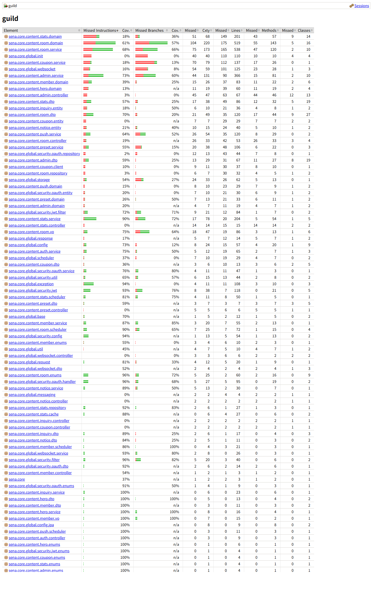

# 테스트 전략

현재 프로젝트의 테스트는 숫자를 채우기보다, 기능을 고치다가 사이드 이펙트가 터지기 쉬운 로직들의 기준을 남기는 데 초점을 뒀습니다.

실시간 상태, 인증 토큰, 통계 집계처럼 한 번 어긋나면 화면에서는 단순한 버그처럼 보이지만 실제로는 여러 도메인이 같이 문제가 되는 부분을 우선해서 테스트했습니다.

---

## 실행

테스트 프로필은 H2를 사용합니다. 외부 저장소나 실제 Firebase, R2 같은 서비스에 의존하지 않도록 필요한 부분은 테스트 설정과 mock으로 분리했습니다.

---

## 테스트를 둔 기준

- 도메인 정책은 서비스 테스트에서 먼저 막습니다.
- 컨트롤러 테스트는 요청을 서비스로 제대로 넘기는지와 응답 형태가 무너지지 않는지를 봅니다.
- 보안 필터, JWT, OAuth2 흐름은 실제 요청 흐름에서 깨지기 쉬운 분기 위주로 확인합니다.
- 스케줄러는 성공 케이스보다 예외가 났을 때 상태를 어떻게 남기는지에 더 신경 썼습니다.
- Swagger/OpenAPI 문서는 내부 모델이 노출되지 않는지 테스트로 확인했습니다.

---

## 집중해서 검증한 영역

### WebSocket / Room

WebSocket 연결 상태와 방 참여 상태를 같은 값으로 보지 않도록 테스트했습니다.

- 오프라인 멤버가 재연결되면 다시 `ACTIVE`가 되는지
- 방장이 오프라인이 됐을 때 다음 활성 멤버에게 권한이 넘어가는지
- 활성 멤버가 없으면 방장을 비워두는지
- disconnect 이벤트 유실에 대비한 보정 스케줄러가 오래된 `ACTIVE` 상태를 정리하는지

관련 테스트:

- `RoomMemberServiceTest`
- `WebSocketActiveMemberReconciliationSchedulerTest`
- `WebSocketEventListenerTest`
- `WebSocketTicketServiceTest`

### Auth / Security

로그인 이후 토큰과 쿠키가 엮이는 부분은 작은 실수에도 사용자 인증 흐름 전체에 영향을 줄 수 있어서 따로 검증했습니다.

- Access Token 만료 시 Refresh Token으로 재발급되는지
- Refresh Token 재사용 의심 상황에서 기존 Access Token을 차단하는지 (느슨하게 처리)
- 관리자 게이트 쿠키가 HMAC 검증을 통과해야 하는지
- 정지 사용자가 쓰기 요청을 할 때 차단되는지

관련 테스트:

- `JwtAuthFilterTest`
- `JwtTokenProviderTest`
- `RefreshTokenServiceTest`
- `AdminGateFilterTest`
- `SuspensionGateFilterTest`

### Stats

통계는 저장하기 좋은 형태와 사용자가 이해하기 좋은 형태가 달라지는 지점이 많았습니다.

- 같은 스킬 순서가 공백 차이로 여러 줄로 나뉘지 않는지
- 승패 집계가 아군/적군 기준에 따라 올바르게 뒤집히는지
- 기여자 랭킹의 주간 기준이 월요일 00:00으로 고정되는지
- 댓글 좋아요 동시 요청처럼 이미 삭제된 상태에서도 count가 깨지지 않는지

관련 테스트:

- `StatsServiceSkillAggregationTest`
- `PersonalStatsServiceTest`
- `ContributorRankingServiceTest`
- `MatchupCommentServiceTest`

### Scheduler / Admin

운영 보조 기능은 화면보다 실제 상태 기록이 더 중요하다고 보고 테스트했습니다.

- 집계할 기록이 없으면 스케줄러가 조기 종료하는지
- 개별 기록 처리 중 예외가 나도 나머지 기록을 계속 처리하는지
- 관리자 시스템 화면에서 등록된 스케줄러를 수동 실행할 수 있는지
- Health 상태를 관리자 화면용 DTO로 바꿀 때 누락된 컴포넌트를 안전하게 표시하는지

관련 테스트:

- `StatsBatchSchedulerTest`
- `RoomSchedulerTest`
- `RoomPurgeSchedulerTest`
- `AdminSystemServiceTest`

---

## 커버리지 리포트

2026-04-24 실행 기준 결과입니다.

| 항목 | 결과 |
|-----|-----|
| 테스트 수 | 398 |
| 실패 | 0 |
| 에러 | 0 |
| 스킵 | 0 |
| Instruction Coverage | 58.78% |
| Line Coverage | 62.23% |
| Branch Coverage | 47.99% |

전체 커버리지는 컨트롤러, DTO, 설정/초기화 클래스, 외부 연동 클라이언트까지 모두 포함한 수치입니다.
이 프로젝트에서는 컨트롤러를 요청 위임과 응답 조립 역할로 얇게 두고, 실제 정책 판단이 들어가는 서비스, 인증/인가, WebSocket, 스케줄러 쪽을 우선해서 테스트했습니다.
그래서 전체 수치만 보기보다는 문제가 생겼을 때 영향이 큰 핵심 영역의 커버리지를 따로 봤습니다.

| 영역 | Instruction | Line | Branch |
|-----|-------------|------|--------|
| `stats.service` | 90.64% | 90.20% | 72.92% |
| `global.security.filter` | 96.30% | 92.50% | 82.14% |
| `global.security.jwt` | 93.47% | 94.07% | 76.47% |
| `global.websocket.service` | 93.16% | 100.00% | 80.00% |
| `room.service` | 68.77% | 69.33% | 66.04% |
| `admin.service` | 73.99% | 75.41% | 60.20% |

리포트 수치는 단순히 전체 커버리지를 높이기 위한 숫자보다, 실제로 운영 중 문제가 되기 쉬운 핵심 서비스 로직, 인증/인가 흐름, WebSocket 상태 복구, 통계 집계, 스케줄러 예외 처리 쪽을 얼마나 지키고 있는지 확인하는 기준으로 봤습니다.
